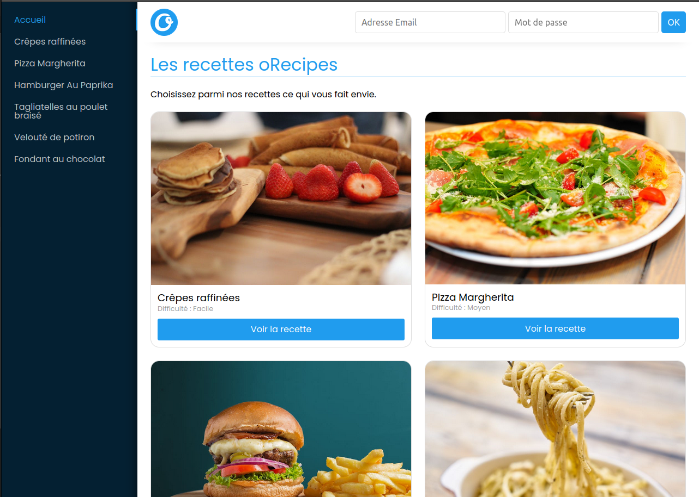
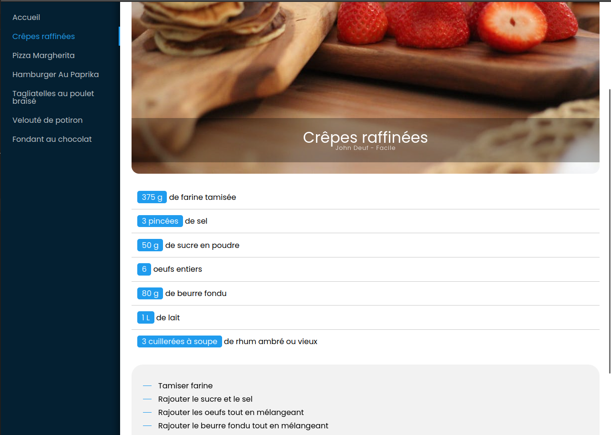

# Orecipes

 

Au Orécipes est un simple blog de recettes de cuisine ou l'utilisateur pourra créer et partager des recettes. Pour le moment seul le côté front est opérationnel. Le côté back de l'application est entièrement à revoir.

## Fonctionnalités futures

- Se connecter
- S'inscrire
- Se déconnecter
- Créer, modifier et supprimer une recette
- Ajouter une recette en favoris

http://projets-portfolio.ovh:3011/
